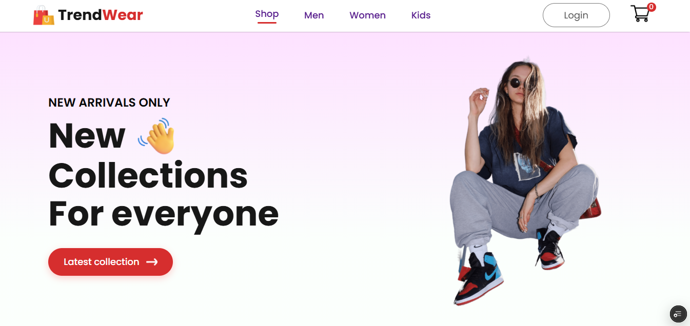
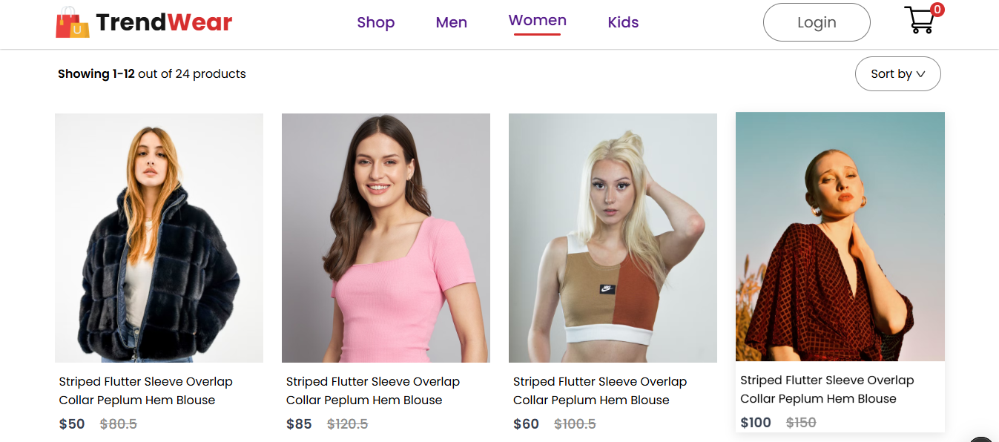
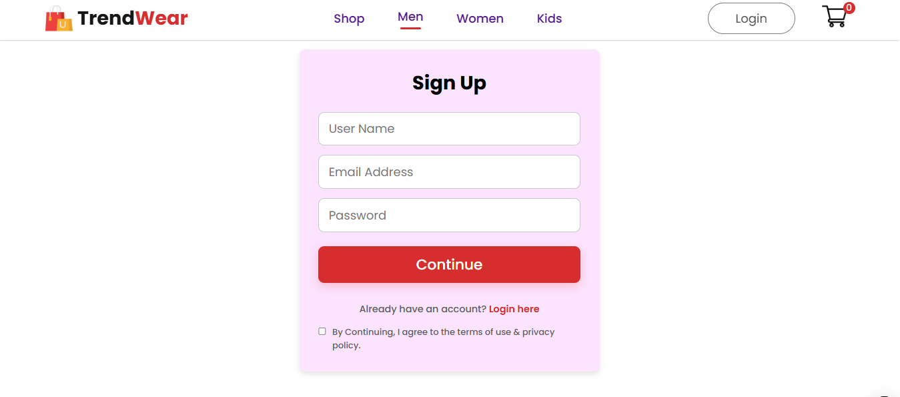
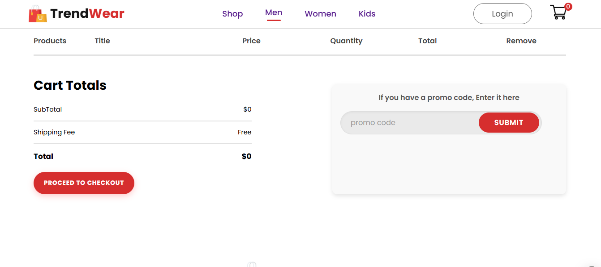

# ✨ TrendWear – Ecommerce Clothing Brand ✨

Thrilled to showcase **TrendWear**, an intuitive and stylish React-powered e-commerce clothing website designed for a seamless shopping experience! 🛍️


##  🎯 Key Features & 🛠️ Tech Stack:

1️⃣ **React & React Router** – Smooth and dynamic navigation with BrowserRouter  
2️⃣ **React-Hook-Form** – Effortless and validated user input for a seamless checkout  
3️⃣ **SweetAlert** – Interactive and user-friendly alert popups  
4️⃣ **React-Icons (FontAwesome)** – Beautiful and accessible UI elements  
5️⃣ **Context API** – Efficient state management for a dynamic shopping cart  
6️⃣ **Google Fonts & Material UI** – Clean, modern, and responsive design  
7️⃣ **Add to Cart & Remove from Cart** – Fully functional shopping cart system  
8️⃣ **Smooth Scroll Behavior** – Enhanced browsing experience with fluid page transitions  


## 📂 Data Management

All product data is structured within JavaScript object files inside the `assets` folder, ensuring flexibility and ease of management.


## 💡 Core Development Approach

This project follows a **component-based architecture**, with well-structured `Components`, `Pages`, and `Context API` for state handling. Hooks like `useState`, `useContext`, and `useParams` power dynamic functionality.
 

## 🔗 Links

- 🌐 **Live Demo**: [https://lnkd.in/drtsgfVk](https://trendwear-clothingsite.vercel.app/)  
- 📁 **GitHub Repo**: [https://lnkd.in/g-m6hC2Y](https://github.com/ankittripathe/TrendWear)


## 📁 Folder Structure

```
📦 src
├── 📁 Components
│   ├── About.jsx
│   ├── Contact.jsx
│   ├── Footer.jsx
│   ├── Header.jsx
│   ├── LoginSignup.jsx
│   ├── Navbar.jsx
│   ├── Project.jsx
│   └── Testimonials.jsx
│
├── 📁 Pages
│   ├── Cart.jsx
│   ├── LoginSignup.jsx
│   ├── LoginSignupNormal.jsx
│   ├── Product.jsx
│   ├── Shop.jsx
│   └── ShopCategory.jsx
│
├── 📁 assets
│   └── assets.js
|
├── App.jsx
├── main.jsx
├── index.css
└── index.html
```


## 💡 What I Learned

While building NexusHome, I enhanced my understanding of:

- Designing **responsive user interfaces** using Tailwind CSS.
- Creating **smooth animations and transitions** with Framer Motion.
- Managing **client-side routing** using React Router DOM.
- **Integrating third-party APIs** like Web3Forms for form submissions.
- Providing **instant user feedback** through React Toastify.


## 📸 Screenshots

| Home Page | Shopping Page |
|-----------|------------|
|  |  |

| Login Page | AddToCart Page |
|-----------|------------|
|  |  |


## 📸 Screenshots

| Home Page |
|-----------|
|  | 

| Shopping Page | 
|-----------|
|  |

| Login Page |
|------------|
 |

| AddToCart Page |
|----------------|
| |


## 📦 Getting Started

### Prerequisites

- Node.js (v14 or above)
- npm or yarn


## 🚀 How to Run the Project

```bash
# 1. Clone the repository
git clone https://github.com/ankittripathe/TrendWear.git
cd TrendWear

# 2. Install dependencies
npm install

# 3. Start the development server
npm run dev
```


## 🤝 Let's Connect

If you're passionate about frontend development, UI/UX, or React-based web apps — let’s connect and collaborate!

🔗 [LinkedIn](https://linkedin.com/in/ankittripathe)  
📧 ankittripathe@gmail.com

## 🌐 Check Out My Portfolio

🔗 [Visit My Developer Portfolio](https://ankittripathi.vercel.app/)
